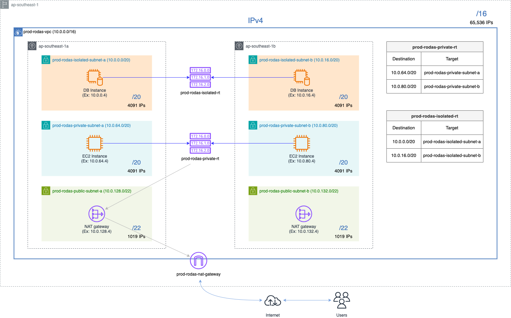

## Introduction
This VPC is built using a simplified version of the **"one-to-many" VPC design**, using **one NAT Gateway** to provide outbound internet access to private subnets. It’s intended for development/staging environments where cost efficiency is prioritized over full fault tolerance.
<!-- 
 -->

## Purpose
- Provide secure network segmentation across public, private, and isolated workloads.
- Route outbound traffic from private subnets through a single NAT Gateway.
- Minimize NAT Gateway cost while maintaining AZ distribution for other resources.

## Components
| Component         | Description                                                               |
|------------------|----------------------------------------------------------------------------|
| VPC              | /16 CIDR range, primary container for networking resources                 |
| Public Subnets   | One per AZ (typically 3), used for ALB, NAT Gateway, and bastion if needed |
| Private Subnets  | One per AZ, for app servers and workloads needing outbound internet access |
| Isolated Subnets | One per AZ, for database or cache layers with no internet connectivity     |
| NAT Gateway      | One instance placed in a single public subnet, used by all private subnets |
| Route Tables     | Separate route tables for each subnet tier, with custom routes for NAT     |
| NACL             | Stateless firewall at the subnet level, used for controlling traffic rules |
